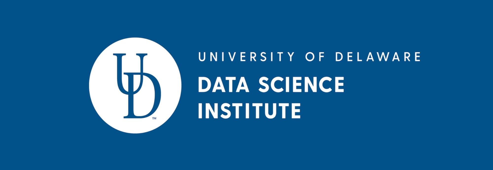

# Code of conduct

**TL;DR. Be respectful and kind. Harassment and abuse are
not tolerated. If you are in a situation that makes you uncomfortable or
unsafe please consult one of the organizers by direct message on slack
or by email.**

Harassment includes but is not limited to:
intimidation, online stalking, harassing, belittling, recording images
or dialogs without permission, sustained disruption or interruptions,
offensive verbal or written comments related categories to gender, age,
sexual orientation, disability, physical appearance, body size, race,
religion, social class, economic status, veteran status, sexual images,
and unwelcome sexual attention. 

Attendees should not use sexualized images, activities,
or other material both in their hack presentations and in communication
with other participants. 

If what you’re doing is making someone feel
uncomfortable that is enough reason to stop doing it. Participants asked
to stop any harassing behavior are expected to comply immediately.
 
 **Reporting Procedures:** 
 If you feel uncomfortable
or think there may be a potential violation of the code of conduct,
please report it immediately to one of the organizers by direct message
on slack or by email.  All reporters have the right to remain anonymous.
Keep in mind that the mentors who are faculty at the University of
Delaware are mandatory reporters for discrimination acts according to
[title IX](https://www.google.com/url?q=https://sites.udel.edu/sexualmisconduct/how-to-report/guidelines-for-reporting) (also see https://www.google.com/url?q=https://github.com/fedhere/FBBTeamResources/blob/master/TitleIX.md).

If a participant engages in harassing behavior, the organizers may take
action including reporting to official University channels. The
organizers identified an ombudsperson Andrea Trungold (andreat@udel.edu)
for confidential reporting since she is
not a mandatory Title IX reporter for confidential reporting. The
ombudsperson can be reached at: [UDCovidhack.ombudsperson@gmail.com](mailto:UDCovidhack.ombudsperson@gmail.com) 

This is a UD event and it complies with the University policies
including https://www.google.com/url?q=https://cpb-us-w2.wpmucdn.com/sites.udel.edu/dist/3/3423/files/2017/08/2017-08-11-Non-DiscrimPolicyFINALupdated120170829-1hadt7n.pdf  https://sites.udel.edu/sexualmisconduct/policies/
